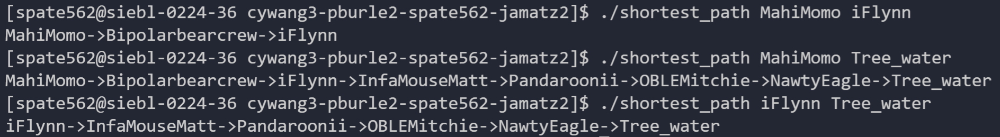

# Results

## Breadth-First Search/Traversal

---

Our goal was to be able to have an output that allowed us to see a BFS traversal of our data which is represented as a graph. We successfully implemented this deliverable with our predicted $O(v^2)$ runtime, where $v$ is the number of vertices.

The BFS traversal allowed us to understand the largest connected components of our graph analytically rather than visually. From this we were able to see the expanse of Twitch streamer connections, and how mutual follows allowed for the creation of massive interconnected communities.

A big discovery for us was the sheer size of some of the connected component as you can see in the included images of our BFS. In our data set, a BFS revealed a massive traversal of 7000+ streamres.

The main reason we had a visual representation as one of our deliverables was because even though BFS could help us see these interconnected Twitch communities, it made it difficult to grasp through a purely text-based output. 

#### BFS Output:

\
&nbsp;
\
&nbsp;

##  Dijkstra's Shortest Path

---

Our goal with Dijkstra's and this deliverable was to be able to trace a path between two streamers through their mutal followers, with emphasis on a path that had the smallest total age diffrential between the channels (this was how we weighed our edges). We successfully implemented this method with our predicted $O(v^2)$, where $v$ is the number of vertices in our data set.

Utilizing Dijkstra's Shortest Path algorithm gave us an effective way to determine if and how two streamers of our choosing were connected through mutual followers with the least weight.

This lead us to an interesting discovery that pairs well with our discovery from our BFS traversal. The longest output of our shortest path algorithm included 12 vertices. This is rather interesting because it once again shows how interconnected all the streamers are in our dataset.

The output of our Dijkstra's Shortest Path method:

\
&nbsp;
\
&nbsp;

##  Force-Directed Graph Visualization

---

Our final deliverable was to create a force-based graph visualization of our dataset. Originally we had implemented this with a Fruchterman-Reingold algorithm on our entire dataset to effectively reposition our streamer nodes visually and create visualization. However, we ran into issues with meaningful visuals with our entire dataset. As a result, we modified the Fruchterman-Reingold algorithm, removed the cooling function and used a smaller user-defined subset of our streamer data in order to visualize our graph.

Thus, we were able to successfully complete this deliverable with a faster runtime of $O(v^2)$ compared to our predicted $O(v^3)$ where $v$ represents the number of vertices in our drawing.

Another aspect of our visual implementation is that it entirely omits nodes that are not as strongly connected to the biggest most connected streamers in the subset of data we are utilizing. This aligns perfectly with our goal to "generate a visually appealing graph that highlights the biggest and most connected streamers."

#### Original graph before modified Fruchterman-Reingold is applied:

#### Final graph after modified Fruchterman-Reingold is applied:

##  

